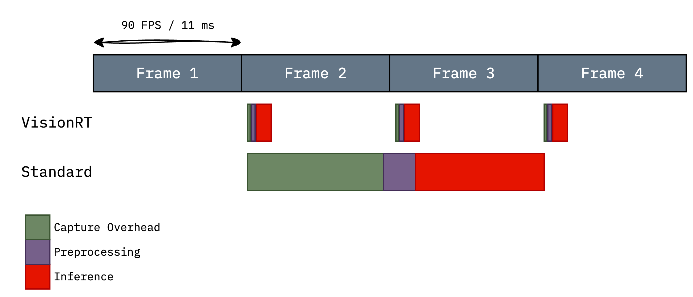
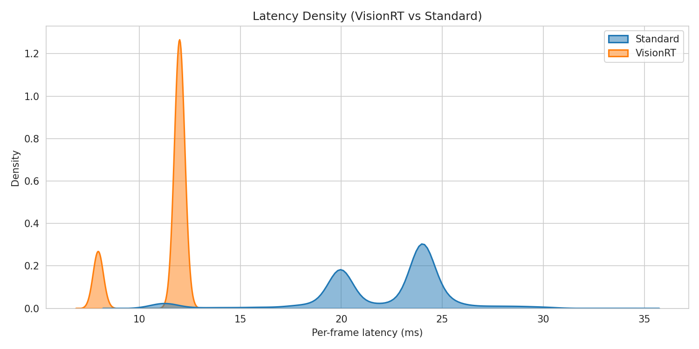

# VisionRT

**Zero-overhead real-time computer vision.** 

Enabled by GPU-resident frame acquisition, FX graph transformations, and CUDA graph capture.

## Same workload, zero overhead



VisionRT fits within the 90 FPS frame budget. The standard pipeline overruns, dropping to ~40-45 FPS.

## Surprisingly Deterministic



**VisionRT is so fast, it reveals your camera's true refresh rate.**

The narrow peaks (~10-12ms) show VisionRT's latency is so low and consistent that you can actually **see the hardware**. In this case, the bimodal distribution is the webcam itself, not software jitter.


>Benchmarked against the standard OpenCV + PyTorch pipeline.
## Requirements

- CUDA 12.8+
- Python 3.11
- PyTorch 2.8
- V4L2 camera device

>**Note:** Add your user to the video group for camera access: `sudo usermod -aG video $USER`


## Installation

```bash
git clone https://github.com/Abiel-Almonte/vision-rt
cd vision-rt
./build_module.sh
```

## Usage

```python
import torch
import torch.nn as nn
from torchvision.models import resnet50, ResNet50_Weights

import visionrt
from visionrt import Camera

visionrt.config.verbose = True
visionrt.config.cudagraphs = True
visionrt.config.optims.fold_conv_bn = True

model = (
    nn.Sequential(
        nn.Upsample(size=(224, 224), mode="bilinear", align_corners=False),
        resnet50(weights=ResNet50_Weights.IMAGENET1K_V2),
        nn.Softmax(dim=1),
    )
    .cuda()
    .eval()
)

camera = Camera("/dev/video0")
model = visionrt.compile(model)

with torch.inference_mode():

    for frame in camera.stream():
        out = model(frame.unsqueeze(0))
```
